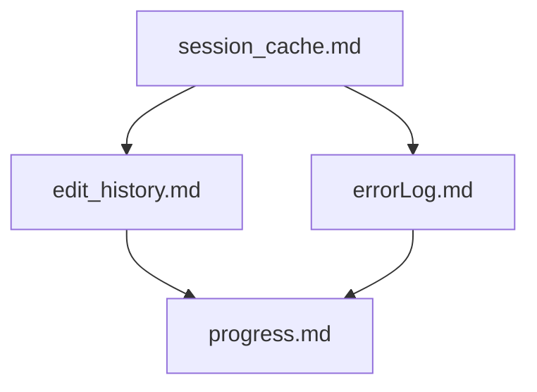
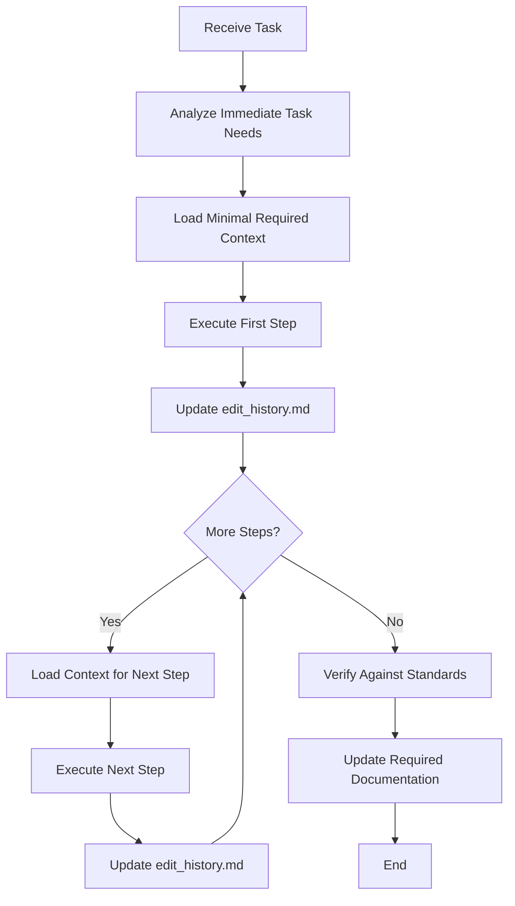
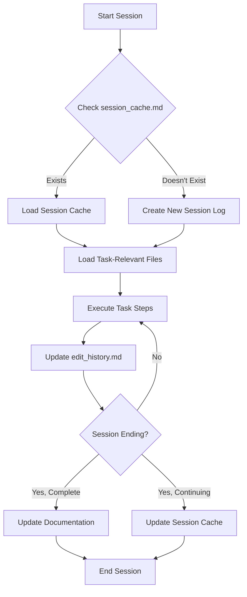
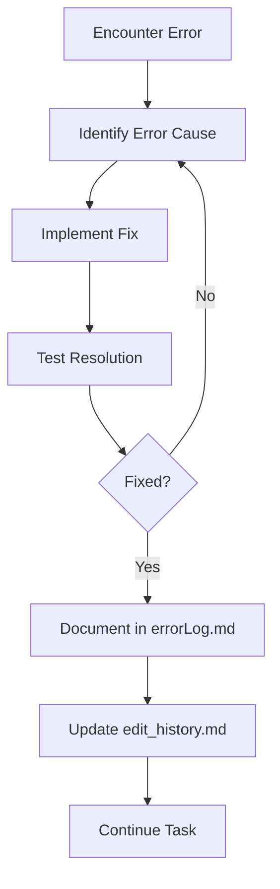

# Integrated Code Rules and Memory Bank System v3

*Last Updated: April 10, 2025*

⚠️ IMPORTANT: NEVER modify files without explicit user approval. Always present a plan and wait for confirmation before making any changes.

### File Locations

- Memory Bank files (session_cache.md, edit_history.md, errorLog.md, etc.) should be located in the `/memory-bank/` directory
- Integrated Rules files remain in the project root
- This structure ensures consistent organization and prevents confusion about file locations

## 1. Unified System Purpose and Philosophy

### 1.1 Core Purpose

The Integrated Code Rules and Memory Bank System is designed to:
- Balance task execution efficiency with comprehensive project knowledge
- Maintain consistent coding standards and documentation practices
- Ensure project continuity across multiple sessions
- Optimize resource usage by loading only necessary information
- Standardize tool usage and communication formats

### 1.2 Balanced Approach

This system implements a balance between:
- **Task-First Efficiency**: Prioritizing immediate task execution with minimal context
- **Consistent Documentation**: Maintaining sufficient project knowledge for continuity
- **Standardized Implementation**: Following consistent coding patterns and practices
- **Progressive Knowledge**: Building and maintaining project history when valuable

### 1.3 Documentation Update Cadence

- `edit_history.md` must be updated on a periodic basis:
  - After every file/folder creation operation
  - After every file edit operation
  - Or at minimum after every few chat messages
  - For rapid sequential edits to the same file, batch updates are acceptable to maintain efficiency
- `errorLog.md` should be updated whenever an error is encountered and resolved
- `session_cache.md` should be updated at session boundaries or significant implementation milestones

## 2. Communication Style

### 2.1 Task-Oriented Communication

1. Use direct, clear statements focused on actions and results
2. Avoid unnecessary explanations of process or methodology
3. Be concise and avoid conversational language
4. Focus on what was done and what will be done next
5. For task discussions, use action-oriented language

### 2.2 Implementation Process

When starting work:
1. Focus immediately on understanding the specific task
2. Load only the minimum files needed for the current step
3. Execute the step completely before getting additional context
4. Document changes in a targeted, minimal way
5. Complete tasks efficiently with minimal information gathering

## 3. Core Memory Bank Files

### 3.1 Essential Files

```
memory-bank/
├── activeContext.md      # Current task context
├── edit_history.md       # File modification log
├── errorLog.md           # Error tracking
├── session_cache.md      # Session state
├── progress.md           # Implementation status
└── projectbrief.md       # Project overview
```

### 3.2 File Templates

#### session_cache.md
```markdown
# Session Cache
*Last Updated: [Date]*

## Status
[CONTINUING/COMPLETE]

## Current Task
[Task description]

## Critical Files
[Relevant files]

## Implementation Progress
1. ✅ [Completed step]
2. 🔄 [In-progress step]
```

#### edit_history.md
```markdown
# Edit History
*Created: [Date]*

## [Date]
### [Time] - [Task]
- Modified `[file]`: [Changes]
```

#### errorLog.md
```markdown
# Error Log
## [Date]: [Error]
**File:** `[path]`
**Fix:** [Solution]
```

#### changelog.md
```markdown
# Changelog
## [Version] - [Date]
### Changed
- [Change description]
```

#### README.md
```markdown
# Project Name
## Overview
[Brief description]

## Key Files
- `[file]`: [Purpose]
```

### 3.3 File Relationships



### 3.4 Validation Rules

1. All files must have:
   - Clear header with last updated date
   - Consistent section formatting
   - Status indicators where applicable

2. Prohibited:
   - Unstructured notes
   - Redundant information
   - File-specific details in wrong documents

### 3.5 Maintenance Guidelines

- Update `edit_history.md` after each file change
- Review `errorLog.md` weekly
- Archive `session_cache.md` after task completion
- Keep `progress.md` focused on current work only

### 3.6 File Size Management Protocol

To prevent `edit_history.md` and `errorLog.md` from becoming excessively large, the following protocol should be implemented:

1.  **Size-Based Rotation:**
    *   The `edit_history.md` and `errorLog.md` files should have an upper limit of 500 lines.
    *   When a file exceeds this limit, it should be moved to an `archive/` subfolder.
    *   The file should be renamed using the format `edit_history_YYYY-MM.md` or `errorLog_YYYY-MM.md`.

2.  **Archiving Process:**
    *   Create an `archive/` subfolder within the `memory-bank/` directory to store the archive files.
    *   The archiving process should be performed automatically when the file size exceeds the limit.

3.  **File Naming Convention:**
    *   Archive files should be named using the format `edit_history_YYYY-MM.md` or `errorLog_YYYY-MM.md`, where YYYY is the year and MM is the month when the file was archived.

4.  **Integration with Memory Bank System:**
    *   Update `projectbrief.md` to include a reference to the `archive/` directory.
    *   Modify the `read_mb` command to optionally load archive files when historical context is needed.

5.  **Application to Other Files:**
    *   While the primary focus is on `edit_history.md` and `errorLog.md`, consider applying similar size-based rotation rules to other Memory Bank files if they become excessively large.

## 4. Implementation Guidelines

### 4.1 Safety & Scope

1. Operate exclusively within the designated project directory and subdirectories
2. Do not access, read, or modify files outside defined scope
3. Avoid executing shell commands that might affect system state
4. Always verify paths before file operations
5. Project building, installation, dependency management, and similar tasks should not be executed by the LLM unless explicitly requested by the user.

### 4.2 Mandatory Step-by-Step Approval

1. NEVER modify files without EXPLICIT user approval first
2. For each discrete file modification:
   - Present a concise description of WHAT will be changed
   - Get explicit approval BEFORE making the change
3. No need to present all planned changes at once - proceed incrementally
4. Complex changes can be broken into manageable approval steps
5. If approval is ambiguous, request clarification
6. Focus on necessary files/components related to the task
7. Avoid unnecessary project-wide scans

### 4.3 Efficiency Rules

1. Do not read file content you already have
2. Avoid reading entire repos or directories
3. Focus only on the specific files needed for the current step
4. When examining code, look for the specific components relevant to the task
5. Trust that you can access more information if needed rather than loading it preemptively

## 5. Integration with Development Workflow

This integrated system is designed to:
- Support rapid task execution while maintaining documentation quality
- Ensure code standards are maintained without excessive overhead
- Provide just enough context for effective implementation
- Document only what's necessary for project continuity
- Balance immediate task needs with long-term project knowledge

## 6. Integrated Command System

### 6.1 Task Execution Commands

| Command | Description |
|---------|-------------|
| `do_task [task]` | Execute specific task with minimal context loading |
| `continue_task` | Resume previous task using minimal context from cache |
| `complete_task` | Finish current task with targeted documentation updates |
| `verify_task` | Check implementation against code standards |

### 6.2 Memory Management Commands

| Command | Description |
|---------|-------------|
| `read_mb` | Load Critical tier files needed for current task |
| `read_mb [file]` | Load specific file only |
| `read_mb standard` | Load Critical + Essential tiers |
| `read_mb complete` | Load all Memory Bank files (rarely needed) |
| `update_mb [file]` | Update specific file with minimal changes |
| `log_error [title]` | Record a new error with details in errorLog.md |
| `record_edits [task]` | Add file modifications to edit_history.md |
| `read_errors [component]` | Load error history for a specific component or error type |

### 6.3 Session Management Commands

| Command | Description |
|---------|-------------|
| `continue_session` | Flag this as a continuation; prioritize session_cache.md |
| `complete_session` | Mark session as complete, update necessary docs |
| `cache_session` | Create continuation point with minimal updates |
| `start_session` | Begin new session with fresh timestamp |

### 6.4 Code Implementation Commands

| Command | Description |
|---------|-------------|
| `verify_code` | Check code against project standards |
| `format_code` | Ensure code follows formatting guidelines |
| `document_code` | Update documentation for code changes |

## 7. Knowledge Organization and Management

### 7.1 Tiered Knowledge Structure

Knowledge is organized in four tiers with task-oriented loading priorities:

1. **Bootstrap Tier (Minimal Required Knowledge)**
   - `bootstrap.md` - Core system structure, loaded only when essential
   - Access only when needed to understand command system

2. **Critical Tier (Task-Relevant Only)**
   - `activeContext.md` - Current state relevant to immediate task
   - `progress.md` - Status information needed for current step
   - `session_cache.md` - Minimal continuity information if continuing a task
   - `errorLog.md` - Record of errors, their causes, and resolutions for reference (load when debugging)
   - `edit_history.md` - Chronological record of file modifications with timestamps (load when context about recent changes is needed)
   - Load only files directly relevant to current task step

3. **Essential Tier (Load Only When Required)**
   - `projectbrief.md` - Reference only when task scope is unclear
   - `.cursorrules` - Reference only when implementation patterns are needed
   - Load only when task requirements aren't clear from Critical tier

4. **Reference Tier (Avoid Unless Specifically Needed)**
   - `productContext.md` - Why and how the project works
   - `systemPatterns.md` - Architecture and design patterns
   - `techContext.md` - Technical implementation details
   - Load only specific files when directly relevant to current task step

### 7.2 Task-First Loading Process

1. Analyze the immediate task requirements
2. Identify the minimal set of files needed for the current step
3. Load only those files directly relevant to the current task
4. Execute the current step completely
5. Load additional files only when needed for the next step
6. Update only files with meaningful changes related to the task

### 7.3 Documentation Decision Framework

| Change Type | Documentation Requirements |
|-------------|----------------------------|
| Interface changes | Update API docs, activeContext.md |
| Implementation details | Code comments only |
| Architecture changes | Update systemPatterns.md |
| New features | Update progress.md, projectbrief.md |
| Bug fixes | Update progress.md only |
| Refactoring | Minimal documentation unless patterns change |
| Error resolution | Update errorLog.md with error details and fix |
| File modification | Update edit_history.md with file changes |
| Multiple file edits | Update both session_cache.md and edit_history.md |
| Ongoing work | Update session_cache.md with clear "in progress" indicators (🔄) |
| Mixed change types | Document according to highest impact change type, ensuring all aspects are covered |

## 8. Technical Implementation Standards

### 8.1 XML Tag Format

Tool use is formatted using XML-style tags:

```
<tool_name>
<parameter1_name>value1</parameter1_name>
<parameter2_name>value2</parameter2_name>
...
</tool_name>
```

### 8.2 File Operations

**Note:** File editing and creation operations should be performed using the Desktop Commander (dc) MCP server. When editing files, the Desktop Commander MCP server should prioritize using block edits (`edit_block` tool) whenever possible to minimize token usage and ensure precise changes.

#### Reading Files

```
<read_file>
<path>src/main.js</path>
</read_file>
```

With line specifications:

```
<read_file>
<path>src/app.ts</path>
<start_line>46</start_line>
<end_line>68</end_line>
</read_file>
```

#### Searching Files

```
<search_files>
<path>.</path>
<regex>your-pattern-here</regex>
<file_pattern>*.ts</file_pattern>
</search_files>
```

#### Directory Listing

```
<list_files>
<path>.</path>
<recursive>false</recursive>
</list_files>
```

#### File Modification (Diff Format)

For precise, surgical modifications:

```
<apply_diff>
<path>File path here</path>
<diff>
<<<<<<< SEARCH
:start_line:1
:end_line:5
-------
def calculate_total(items):
    total = 0
    for item in items:
        total += item
    return total
=======
def calculate_total(items):
    """Calculate total with 10% markup"""
    return sum(item * 1.1 for item in items)
>>>>>>> REPLACE
</diff>
</apply_diff>
```

#### File Creation/Overwriting

```
<write_to_file>
<path>config.json</path>
<content>
{
  "apiEndpoint": "https://api.example.com",
  "version": "1.0.0"
}
</content>
</write_to_file>
```

### 8.3 Code Standards

- Use modular design with clear separation of concerns
- Make surgical, precise changes when editing existing files
- Maintain consistent indentation and formatting
- Document interfaces and APIs with clear specifications
- Follow asynchronous patterns for I/O operations
- Implement proper error handling and validation

### 8.4 Documentation Standards

- Update only files with meaningful changes
- Include creation and last updated timestamps
- Use clear section headings with ## heading level
- Use status indicators: ✅ (Complete), 🔄 (In Progress), ⬜ (Not Started)
- Make targeted updates rather than comprehensive rewrites

## 9. Integrated Workflows

### 9.1 Task-First Implementation Flow



**Note:** The "Execute First Step" and "Execute Next Step" boxes inherently include multiple edit operations, each of which should trigger the `record_edits` command to update `edit_history.md`. The diagram simplifies this cycle for clarity.

### 9.2 Session Management Flow



**Note:** Use `record_edits` command after each file modification, and `cache_session` command when creating continuation points. The "ExecuteTask" box represents multiple cycles of implementation and documentation.

### 9.3 Documentation Update Process

1. After completing a task, determine documentation requirements based on change type
2. Update only the necessary files based on the Documentation Decision Framework
3. Always update timestamps and status indicators
4. For continuing tasks, update session_cache.md with minimal state information
5. For completed tasks, update relevant Memory Bank files based on impact
6. Update edit_history.md after each file modification (using `record_edits`) or at most every few messages
7. Log errors in errorLog.md (using `log_error`) when encountered and document their resolution

### 9.4 Error Handling and Resolution Flow



**Note:** Use the `log_error` command when documenting errors in errorLog.md, and the `record_edits` command when updating edit_history.md with the fixes applied.

## 10. Core File Structure and Templates

### 10.1 session_cache.md (Task-Oriented Version)

```markdown
# Session Cache

*Last Updated: [Date]*

## Status
[CONTINUING or COMPLETE]

## Current Task
[Specific task in progress]

## Current Step
[Exact step in the process]

## Critical Files
[Only files needed to continue the task]

## State Information
[Minimal state needed to continue]

## Implementation Progress
1. ✅ [Completed step]
2. ✅ [Completed step]
3. 🔄 [In-progress step]
4. ⬜ [Planned step]
5. ⬜ [Planned step]

## Design Decisions
- [Key decision made during implementation]
- [Rationale for technical approach]
- [Important architectural choices]
- [Implementation patterns selected]

## Notes
[Additional context relevant for continuing the task]
```

The template format is flexible as long as all required sections are present and clearly labeled.

### 10.2 activeContext.md (Task-Oriented Version)

```markdown
# Active Context

*Last Updated: [Date]*

## Current Tasks
[List of active tasks with current status]

## Implementation Focus
[Specific components currently being modified]

## Current Decisions
[Only decisions directly affecting current tasks]

## Next Actions
[Specific next steps for current tasks]
```

### 10.3 Time-stamped Session Logs

```markdown
# Session Log: [ISO Date-Time]

## Task Focus
[Specific tasks addressed in this session]

## Implementation Steps
[Steps taken during implementation]

## Decisions Made
[Key decisions with rationale]

## Status
[COMPLETE or CONTINUING]

## Next Steps
[Only if continuing]
```

### 10.4 errorLog.md (Error Tracking and Resolution)

The error log should follow this structure for each error entry:

```markdown
# Error Log

## [YYYY-MM-DD HH:MM TZ]: [Error Title/Component]

**File:** `[file path]`

**Error Message:**
\`\`\`
[Exact error message text]
\`\`\`

**Cause:**
[Brief explanation of what caused the error]

**Fix:**
[Steps taken to resolve the error]

**Key Code Changes:**
\`\`\`[language]
[Code snippet or diff showing the fix]
\`\`\`

**Affected Files:**
- [List of files modified to fix the error]
```

The format may be adjusted as needed while maintaining the key information sections (File, Error Message, Cause, Fix, and Affected Files).

### 10.5 edit_history.md (File Modification Tracking)

The edit history should be organized chronologically with timestamps:

```markdown
# Edit History

*Created: [Date]*

## File Modification Log

### [Date]

#### [Time] - [Brief Task Description]

- Created/Modified/Updated `[file path]` - [Brief description of changes]
- Created/Modified/Updated `[file path]` - [Brief description of changes]
- ...

#### [Time] - [Brief Task Description]

- ...
```

For rapid sequential edits, changes can be batched under a single time entry to maintain efficiency while preserving the chronological record.

## 11. External Tools and Integration

### 11.1 MCP (Model Context Protocol) Servers

Available MCP servers include:

- **deepwebresearch**: Web research and content extraction
- **youtube**: Video analysis and content retrieval
- **github**: Repository management and interaction

#### Example: MCP Tool Usage

```
<use_mcp_tool>
<server_name>github</server_name>
<tool_name>get_file_contents</tool_name>
<arguments>
{
  "owner": "username",
  "repo": "repository",
  "path": "file.js"
}
</arguments>
</use_mcp_tool>
```

### 11.2 API Integration

- Use structured JSON for data exchange
- Implement proper error handling for API responses
- Follow RESTful principles for endpoint design
- Document all API contracts as part of the implementation

### 11.3 External Libraries

- Prefer established libraries over custom implementations
- Document dependencies in the appropriate Memory Bank files
- Maintain compatibility with existing project dependencies
- Verify license compatibility before introducing new dependencies

Remember: The system's effectiveness comes from balancing task efficiency with appropriate documentation, loading only what's needed when it's needed, and following a consistent, standardized approach to both code and documentation.
