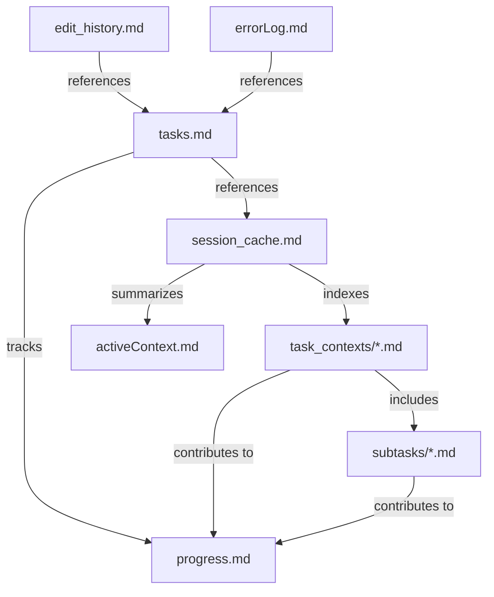

# Integrated Code Rules and Memory Bank System v5.0

*Last Updated: April 17, 2025*

⚠️ IMPORTANT: NEVER modify files without explicit user approval. Always present a plan and wait for confirmation before making any changes.

## Table of Contents
1. [Unified System Purpose and Philosophy](#1-unified-system-purpose-and-philosophy)
2. [Communication Style](#2-communication-style)
3. [Core Memory Bank Files](#3-core-memory-bank-files)
   - [Essential Files and Structure](#31-essential-files-and-structure)
   - [Task Context Files](#32-task-context-files)
   - [File Templates](#33-file-templates)
   - [File Relationships](#34-file-relationships)
   - [Validation Rules](#35-validation-rules)
   - [Maintenance Guidelines](#36-maintenance-guidelines)
   - [File Size Management Protocol](#37-file-size-management-protocol)
4. [Implementation Guidelines](#4-implementation-guidelines)
5. [Integration with Development Workflow](#5-integration-with-development-workflow)
6. [Integrated Command System](#6-integrated-command-system)
   - [Task Management Commands](#61-task-management-commands)
   - [Subtask Management Commands](#62-subtask-management-commands)
   - [Task Execution Commands](#63-task-execution-commands)
   - [Memory Management Commands](#64-memory-management-commands)
   - [Session Management Commands](#65-session-management-commands)
   - [Code Implementation Commands](#66-code-implementation-commands)
7. [Knowledge Organization and Management](#7-knowledge-organization-and-management)
8. [Technical Implementation Standards](#8-technical-implementation-standards)
9. [Integrated Workflows](#9-integrated-workflows)
10. [Core File Structure and Templates](#10-core-file-structure-and-templates)
11. [Task Hierarchy Management](#11-task-hierarchy-management)
12. [External Tools and Integration](#12-external-tools-and-integration)

## 1. Unified System Purpose and Philosophy

### 1.1 Core Purpose

The Integrated Code Rules and Memory Bank System balances task execution with project knowledge while maintaining standards across sessions and organizing complex work in a structured hierarchy.

### 1.2 Balanced Approach

This system prioritizes task execution with minimal but sufficient context while organizing work in an interconnected hierarchy of parent-child relationships.

### 1.3 Documentation Update Cadence

- `tasks.md` must be updated whenever creating, pausing, resuming, or completing a task or subtask
- `edit_history.md` must be updated on a periodic basis:
  - After every file/folder creation operation
  - After every file edit operation
  - Or at minimum after every few chat messages
  - For rapid sequential edits to the same file, batch updates are acceptable to maintain efficiency
  - Each entry should include the relevant task ID
- `errorLog.md` should be updated whenever an error is encountered and resolved, with reference to the related task ID
- `session_cache.md` should be updated at session boundaries, when switching tasks, or at significant implementation milestones
- `task_contexts/task_context_[TaskID].md` should be updated when significant progress is made on a task or when switching between tasks
- `subtasks/subtask_[ParentID]_[SubtaskID].md` should be updated when working on specific subtasks

## 2. Communication Style

### 2.1 Task-Oriented Communication

1. Use direct, clear statements focused on actions and results
2. Avoid unnecessary explanations of process or methodology
3. Be concise and avoid conversational language
4. Focus on what was done and what will be done next
5. For task discussions, use action-oriented language
6. Reference task IDs and subtask IDs when discussing specific work items
7. Maintain hierarchy awareness by indicating parent-child relationships
8. Use consistent terminology across related task contexts

### 2.2 Implementation Process

When starting work:
1. Focus immediately on understanding the specific task or subtask
2. Assign a task ID and register it in tasks.md (or link it to a parent task if it's a subtask)
3. Load only the minimum files needed for the current step
4. Execute the step completely before getting additional context
5. Document changes in a targeted, minimal way, referencing the task ID
6. Complete tasks efficiently with minimal information gathering
7. When switching tasks, preserve context by updating the appropriate task context file
8. For complex tasks, create a hierarchy with subtasks as needed

## 3. Core Memory Bank Files

### 3.1 Essential Files and Structure

```
memory-bank/
├── activeContext.md            # Current task context summary
├── edit_history.md             # File modification log (with task references)
├── errorLog.md                 # Error tracking (with task references)
├── session_cache.md            # Multi-task session index
├── tasks.md                    # Task registry and tracking
├── progress.md                 # Implementation status
├── projectbrief.md             # Project overview
├── task_contexts/              # Individual task context files
│   ├── task_context_T1.md      # Context for Task T1
│   ├── task_context_T2.md      # Context for Task T2
│   └── ...
└── subtasks/                   # Detailed subtask contexts
    ├── subtask_T1_1.md         # Context for Subtask 1 of Task T1
    ├── subtask_T1_2.md         # Context for Subtask 2 of Task T1
    └── ...

templates/                      # Template files for memory bank documents
├── session_cache.md
├── tasks.md
├── task_context.md
├── subtask_context.md
└── ...
```

### 3.2 Task Context Files

Task context files are designed to store detailed information about individual tasks, breaking up the monolithic session_cache.md into manageable, focused modules:

1. **Primary Task Context Files**
   - Located in the `task_contexts/` directory
   - Named using the pattern `task_context_T[n].md` (e.g., `task_context_T1.md`)
   - Contains detailed information about task implementation, progress, and state
   - References related subtasks when applicable
   - Updated whenever significant progress is made on the task

2. **Subtask Context Files**
   - Located in the `subtasks/` directory
   - Named using the pattern `subtask_T[parent]_[n].md` (e.g., `subtask_T1_2.md`)
   - Contains implementation details specific to the subtask
   - Links back to the parent task
   - Created when a subtask requires significant independent context

3. **When to Create Separate Files**
   - Create a separate subtask file for substantial independent work
   - Use sections within parent task file for smaller, tightly coupled subtasks

### 3.3 File Templates

Templates for all memory bank files are stored in the `/templates/` directory at the project root. New templates have been added to support the modular task context structure:

1. **task_context.md** - Template for individual task context files
2. **subtask_context.md** - Template for subtask context files
3. **session_cache.md** - Updated template for the session index file

All templates follow the formats defined in section 10 and provide consistent structure across the memory bank system.

### 3.4 File Relationships



All files work together through task ID references for cross-file traceability.

### 3.5 Validation Rules

1. All files must have:
   - Clear header with last updated date
   - Consistent section formatting
   - Status indicators where applicable
   - Task ID references where applicable

2. Task Context Files must include:
   - Reference to the parent task ID in subtask files
   - List of subtasks in parent task files
   - Current implementation status
   - Links to related files

3. Prohibited:
   - Unstructured notes
   - Redundant information across files
   - File-specific details in wrong documents
   - Missing task ID references
   - Orphaned subtasks (not referenced by a parent task)
   - Circular parent-child relationships

### 3.6 Maintenance Guidelines

- Update `tasks.md` whenever task status changes or subtasks are created
- Update `task_contexts/task_context_[TaskID].md` when:
  - Making significant progress on a task
  - Creating or completing subtasks
  - Switching focus between tasks
  - Reaching implementation milestones
- Update `subtasks/subtask_[ParentID]_[SubtaskID].md` when:
  - Working on that specific subtask
  - Completing significant subtask milestones
- Update `edit_history.md` after each file change, with task/subtask ID reference
- Update `session_cache.md` when switching between tasks
- Review and prune `task_contexts/` directory after major milestones
- Archive completed task and subtask context files after they've been completed for 30 days
- Keep `progress.md` organized by task ID with subtasks nested under parent tasks

### 3.7 File Size Management Protocol

To prevent files from becoming excessively large, the following protocol should be implemented:

1. **Size-Based File Splitting:**
   - Individual task context files should have an upper limit of 500 lines
   - When a task grows complex, decompose it into subtasks with separate context files
   - `edit_history.md` and `errorLog.md` files should have an upper limit of 500 lines
   - `tasks.md` should archive completed tasks after they have been complete for more than 30 days
   - `session_cache.md` should remain a lightweight index (less than 200 lines)

2. **Archiving Process:**
   - When a file exceeds its size limit, move older content to an `archive/` subfolder
   - For task context files, create subtask breakdowns instead of archiving
   - Use the established naming convention: `[filename]_YYYY-MM.md`
   - Maintain an `archive/` subfolder within the `memory-bank/` directory

3. **Modular Structure Benefits:**
   - Prevents large files by distributing content

4. **Context Pruning:**
   - Periodically review task context files to remove unnecessary details
   - Focus on maintaining just enough context to resume work efficiently
   - Archive completed task and subtask context files after 30 days

## 4. Implementation Guidelines

### 4.1 Safety & Scope

1. Operate exclusively within the designated project directory and subdirectories
2. Do not access, read, or modify files outside defined scope
3. Avoid executing shell commands that might affect system state
4. Always verify paths before file operations
5. Project building, installation, dependency management, and similar tasks should not be executed by the LLM unless explicitly requested by the user

### 4.2 Mandatory Step-by-Step Approval

1. NEVER modify files without EXPLICIT user approval first
2. For each discrete file modification:
   - Present a concise description of WHAT will be changed
   - Get explicit approval BEFORE making the change
3. No need to present all planned changes at once - proceed incrementally
4. Complex changes can be broken into manageable approval steps
5. If approval is ambiguous, request clarification
6. Focus on necessary files/components related to the task or subtask
7. Avoid unnecessary project-wide scans

### 4.3 Efficiency Rules

1. Do not read file content you already have
2. Avoid reading entire repos or directories
3. Focus only on the specific files needed for the current step
4. When examining code, look for the specific components relevant to the task or subtask
5. Trust that you can access more information if needed rather than loading it preemptively
6. When switching tasks or subtasks, only load the minimum context needed for the new focus
7. Use task context files to avoid reloading information already documented

## 5. Integration with Development Workflow

The modular task structure enables efficient work organization with appropriate context while maintaining clear task boundaries.

## 6. Integrated Command System

### 6.1 Integrated Command System

| Category | Command | Description |
|----------|---------|-------------|
| **Task Management** | `create_task [title]` | Create new task with unique ID |
| | `switch_task [task_id]` | Switch focus to different task |
| | `pause_task [task_id]` | Mark task as paused |
| | `resume_task [task_id]` | Resume a paused task |
| | `complete_task [task_id]` | Mark task as completed |
| | `update_task [task_id]` | Update task details |
| | `link_tasks [parent_id] [child_id]` | Create task relationship |
| **Subtask Management** | `create_subtask [parent_id] [title]` | Create subtask |
| | `switch_subtask [parent_id] [subtask_id]` | Switch to subtask |
| | `complete_subtask [parent_id] [subtask_id]` | Complete subtask |
| | `update_subtask [parent_id] [subtask_id]` | Update subtask |
| | `promote_subtask [subtask_id]` | Convert to full task |
| **Task Execution** | `do_task [task_id]` | Execute specific task |
| | `do_subtask [parent_id] [subtask_id]` | Execute specific subtask |
| | `continue_task [task_id]` | Resume previous task |
| | `verify_task [task_id]` | Check implementation |
| **Memory Management** | `read_mb` | Load Critical tier files |
| | `read_mb [file]` | Load specific file |
| | `read_mb standard` | Load Critical + Essential tiers |
| | `read_task_context [task_id]` | Load task context |
| | `update_mb [file]` | Update specific file |
| | `log_error [title] [task_id]` | Record error |
| | `record_edits [task_id] [description]` | Log file changes |
| **Session Management** | `continue_session` | Continue previous session |
| | `complete_session` | End session and update docs |
| | `start_session` | Begin new session |
| **Code Implementation** | `verify_code` | Check code standards |
| | `format_code` | Ensure proper formatting |
| | `document_code` | Update documentation |

## 7. Knowledge Organization and Management

### 7.1 Tiered Knowledge Structure

Knowledge is organized in four tiers with task-oriented loading priorities:

1. **Bootstrap Tier (Minimal Required Knowledge)**
   - `bootstrap.md` - Core system structure, loaded only when essential
   - `tasks.md` - Registry of all tasks and subtasks, loaded when task IDs are needed
   - Access only when needed to understand command system or task structure

2. **Critical Tier (Task-Relevant Only)**
   - `activeContext.md` - Current state relevant to immediate task/subtask
   - `progress.md` - Status information needed for current step
   - `session_cache.md` - Task index and current session status
   - `task_contexts/task_context_[CurrentTask].md` - Context for the current task
   - `subtasks/subtask_[CurrentTask]_[SubtaskID].md` - Context for the current subtask (if applicable)
   - `errorLog.md` - Record of errors relevant to current task (load when debugging)
   - `edit_history.md` - Recent file modifications relevant to current task
   - Load only files directly relevant to current task step

3. **Essential Tier (Load Only When Required)**
   - `projectbrief.md` - Reference only when task scope is unclear
   - `.cursorrules` - Reference only when implementation patterns are needed
   - Task contexts for related tasks that impact current work
   - Load only when task requirements aren't clear from Critical tier

4. **Reference Tier (Avoid Unless Specifically Needed)**
   - `productContext.md` - Why and how the project works
   - `systemPatterns.md` - Architecture and design patterns
   - `techContext.md` - Technical implementation details
   - Task contexts for unrelated tasks
   - Historical subtask contexts
   - Load only specific files when directly relevant to current task step

### 7.2 Task-First Loading Process

1. Analyze the immediate task or subtask requirements
2. Identify task/subtask ID in tasks.md or create a new task/subtask
3. Load task context from the appropriate context file:
   - For main tasks: `task_contexts/task_context_[TaskID].md`
   - For subtasks: `subtasks/subtask_[ParentID]_[SubtaskID].md`
4. Identify the minimal set of files needed for the current step
5. Load only those files directly relevant to the current task/subtask
6. Execute the current step completely
7. Update the task/subtask context file with progress and current state
8. Load additional files only when needed for the next step
9. When switching tasks/subtasks, update context files to preserve state

### 7.3 Documentation Decision Framework

| Change Type | Documentation Requirements |
|-------------|----------------------------|
| Task creation | Update tasks.md with new task ID and details, create task context file |
| Subtask creation | Update tasks.md and parent task context file, create subtask context file if complex |
| Task status change | Update tasks.md and relevant task context file with new status |
| Task switching | Update both previous and new task context files, update session_cache.md |
| Interface changes | Update API docs, activeContext.md, task context file with reference |
| Implementation details | Code comments, task/subtask context file, edit_history.md with ID |
| Architecture changes | Update systemPatterns.md, task context file, add task reference |
| New features | Update progress.md, projectbrief.md, task context file with reference |
| Bug fixes | Update progress.md, task context file with reference |
| Refactoring | Task context file, minimal other documentation unless patterns change |
| Error resolution | Update errorLog.md with error details, fix, and task/subtask ID |
| File modification | Update edit_history.md and task/subtask context file with changes |
| Multiple file edits | Update task/subtask context, session_cache.md, and edit_history.md |
| Ongoing work | Update task/subtask context with clear "in progress" indicators (🔄) |
| Mixed change types | Document according to highest impact change type with task/subtask ID |
| Subtask completion | Update parent task context, tasks.md, and subtask context file |

## 8. Technical Implementation Standards

### 8.1 XML Tag Format

Tool use is formatted using XML-style tags:

```
<tool_name>
<parameter1_name>value1</parameter1_name>
<parameter2_name>value2</parameter2_name>
...
</tool_name>
```

### 8.2 File Operations

**Note:** File editing and creation operations should be performed using the Desktop Commander (dc) MCP server. When editing files, the Desktop Commander MCP server should prioritize using block edits (`edit_block` tool) whenever possible to minimize token usage and ensure precise changes.

#### Reading Files

```
<read_file>
<path>src/main.js</path>
</read_file>
```

With line specifications:

```
<read_file>
<path>src/app.ts</path>
<start_line>46</start_line>
<end_line>68</end_line>
</read_file>
```

#### Task Context Files

```
<read_file>
<path>memory-bank/task_contexts/task_context_T1.md</path>
</read_file>
```

```
<read_file>
<path>memory-bank/subtasks/subtask_T1_2.md</path>
</read_file>
```

#### Searching Files

```
<search_files>
<path>.</path>
<pattern>your-pattern-here</pattern>
<file_pattern>*.ts</file_pattern>
</search_files>
```

#### Directory Listing

```
<list_directory>
<path>memory-bank/task_contexts</path>
</list_directory>
```

#### File Modification (Block Edit Format)

For precise, surgical modifications:

```
<edit_block>
<blockContent>File path here
<<<<<<< SEARCH
Original content to find
=======
New content to replace with
>>>>>>> REPLACE
</blockContent>
</edit_block>
```

## 9. Integrated Workflows

### 9.1 Workflow Processes

#### Task Implementation Flow
1. Create/load task → determine subtask needs → load minimal context
2. Execute step → record edits (with task ID) → update context → repeat until complete
3. Verify implementation → mark task complete/update session

#### Multi-Task Management
1. Load tasks/session → select task → load appropriate context
2. Execute steps (updating edit_history and context) → mark complete when done
3. For subtasks, update parent when complete
4. When switching tasks, update session_cache.md

#### Documentation Process
1. Always reference task IDs in all updates
2. Update edit_history.md after each file modification
3. Update task context files with current state
4. Log errors with task references
5. Use appropriate status indicators (🔄, ✅, ⏸️, ⬜)

#### Error Handling
1. Identify → fix → test → if resolved: document and continue
2. Document in errorLog.md with task ID reference

#### Task Hierarchy Management
1. For complex tasks: break down into subtasks → link to parent → create context files as needed
2. Implement subtasks in order → update parent after each → mark parent complete when all done

## 10. Core File Structure and Templates

### 10.1 tasks.md (Task Registry with Subtask Support)

```markdown
# Task Registry
*Updated: [Date]*

## Active Tasks
| ID | Title | Status | Priority | Dependencies |
|----|-------|--------|----------|--------------|
| T1 | Task1 | 🔄 | HIGH | - |
| T2 | Task2 | 🔄 | MED | - |
| T3 | Task3 | ⏸️ | LOW | T1 |

## Task Details
### T1: [Title]
- **Desc**: [Brief description]
- **Status**: 🔄 **Last**: [Date]
- **Criteria**: [Key completion points]
- **Subtasks**: T1.1 (🔄), T1.2 (✅), T1.3 (⬜)
- **Files**: `[file1]`, `[file2]`
- **Notes**: [Key context]

### [Other tasks follow same format]

## Completed Tasks
| ID | Title | Date | Related |
|----|-------|------|---------|
| T0 | Setup | 2025-04-07 | - |
```

### 10.2 session_cache.md (Task Index Version)

```markdown
# Session Cache
*Updated: [Date]*

## Overview
- Active: [Count] | Paused: [Count] | Focus: [Task ID]

## Tasks
- T1: [Brief] - 🔄
  - T1.1: [Brief] - 🔄
  - T1.2: [Brief] - ✅
- T2: [Brief] - 🔄
- T3: [Brief] - ⏸️

## Current Focus
Task [ID]: [Brief context]

## Context Files
- Active: task_context_T1.md, subtask_T1_1.md, task_context_T2.md
- Paused: task_context_T3.md

## Notes
[Cross-task notes]
```

### 10.3 task_context_[TaskID].md (Task Context Template)

```markdown
# Task Context: [ID] - [Title]
*Updated: [Date]*

## Details
- **Status:** 🔄 **Priority:** [H/M/L]
- **Started:** [Date] **Last:** [Date]
- **Dependencies:** [IDs] **Parent:** [ID if applicable]

## Context
[Essential resumption context]

## Subtasks
- [ID1]: [Title] - 🔄
  - [Brief context and files]
- [ID2]: [Title] - ✅
  - [Completion summary]
- [ID3]: [Title] - ⬜
  - [Brief plan]

## Files
- `[file1]`: [relevance]
- `[file2]`: [relevance]

## Progress
1. ✅ [Done]
2. 🔄 [Current]
3. ⬜ [Next]

## Working State
[Key variables/decisions]

## Related Tasks
- [ID1]: [Relationship]
```

### 10.4 subtask_[ParentID]_[SubtaskID].md (Subtask Context Template)

```markdown
# Subtask: [Parent].[ID] - [Title]
*Updated: [Date]*

## Details
- **Parent:** [ID] - [Title]
- **Status:** 🔄 **Priority:** [H/M/L]
- **Started:** [Date] **Last:** [Date]

## Context
[Essential resumption context]

## Files
- `[file1]`: [relevance]
- `[file2]`: [relevance]

## Progress
1. ✅ [Done]
2. 🔄 [Current]
3. ⬜ [Next]

## Parent Relationship
[Contribution to parent task]
```

### 10.5 activeContext.md (Multi-Level Task Version)

```markdown
# Active Context
*Updated: [Date]*

## Focus
- **Primary:** [Task ID]
- **Subtask:** [Subtask ID]
- **Secondary:** [Task IDs]

## Active Tasks
- T1: [Brief] - [Current step]
  - T1.1: [Brief] - [Current step]
- T2: [Brief] - [Current step]

## Current Components
[Components being modified]

## Task Context
- T1: [Key context]
  - T1.1: [Key context]
- T2: [Key context]

## Next Actions
- T1: [Next action]
  - T1.1: [Next action]
- T2: [Next action]
```

### 10.6 edit_history.md (With Task/Subtask References)

```markdown
# Edit History
*Created: [Date]*

## [Date]
### [Time] - [Task ID].[Subtask ID]: [Brief Description]
- Modified `[file]` - [Brief change description]
- Created `[file]` - [Brief description]

### [Time] - [Task ID]: [Brief Description]
- [File changes]
```

### 10.7 errorLog.md (With Task/Subtask References)

```markdown
# Error Log

## [YYYY-MM-DD HH:MM]: [Task ID].[Subtask ID] - [Error Title]
- **File:** `[file path]`
- **Error:** `[Error message]`
- **Cause:** [Brief explanation]
- **Fix:** [Steps taken]
- **Changes:** [Key code changes]
- **Affected:** [Modified files]
- **Task:** [Task ID].[Subtask ID]
```

### 10.8 progress.md (Hierarchical Task Version)

```markdown
# Progress
*Updated: [Date]*

## Active Tasks

### [ID]: [Title]
- **Status:** 🔄 **Priority:** [H/M/L]
- **Subtasks:** [ID1] 🔄, [ID2] ✅, [ID3] ⬜
- **Done:** [Steps completed]
- **Current:** [Current step]
- **Next:** [Next steps]

### [Other tasks follow same format]

## Completed Tasks
### [ID]: [Title]
- **Completed:** [Date]
- **Summary:** [Brief accomplishment summary]
- **Subtasks:** [ID1], [ID2] (completed [Dates])
```

## 11. Task Hierarchy Management

### 11.1 Task Hierarchies and Relationships

Task hierarchies provide a structured approach to organizing complex work:

1. **Parent-Child Relationships**
   - **Parent Tasks**: Represent larger objectives or features
   - **Subtasks**: Represent component parts of the parent task
   - **Nested Subtasks**: Can be used for further decomposition (e.g., T1.2.3)
   - **Sibling Tasks**: Related tasks at the same level

2. **Relationship Types**
   - **Contains**: Parent task contains subtasks (T1 contains T1.1, T1.2, etc.)
   - **Depends On**: Task requires another to be completed first (T2 depends on T1)
   - **Blocks**: Task prevents progress on another (T3 blocks T4)
   - **Related To**: Tasks share context or implementation details
   - **Alternative To**: Tasks represent different approaches to the same goal

3. **Visual Representation**
   - Use mermaid diagrams in tasks.md to visualize task relationships
   - Solid arrows (-->) for direct dependencies
   - Dashed arrows (-..->) for soft dependencies or relationships
   - Nested boxes for containment relationships

### 11.2 Task Decomposition Guidelines

When to decompose a task into subtasks:

1. **Complexity Indicators**
   - Tasks that span components or require multiple steps
   - Tasks touching multiple files or requiring different expertise

2. **Decomposition Strategy**
   - Break down by component, phase, or feature 
   - Ensure clear boundaries between subtasks

3. **Optimal Subtask Size**
   - Completable in 2-4 hours with verifiable outcome

### 11.3 Task ID and Naming Conventions

1. **Task ID Structure**
   - Main tasks: T1, T2, T3, etc.
   - First-level subtasks: T1.1, T1.2, etc.
   - Second-level subtasks: T1.1.1, T1.1.2, etc.
   - Maximum recommended nesting: 3 levels (e.g., T1.2.3)

2. **Task Naming Guidelines**
   - Begin with action verb (Implement, Create, Fix, Refactor, etc.)
   - Be specific about the component or functionality
   - Include scope limitations when appropriate
   - Keep names concise but descriptive

3. **Context File Naming**
   - Main task context: `task_context_T1.md`
   - First-level subtask: `subtask_T1_1.md`
   - Second-level subtask: `subtask_T1_1_1.md`
   - Always use underscores as separators for consistency

### 11.4 Task Promotion and Demotion

1. **Subtask Promotion**
   - When a subtask grows in scope or complexity
   - When a subtask becomes independent of its original parent
   - When a subtask needs its own subtasks

2. **Promotion Process**
   - Create new main task entry in tasks.md
   - Copy relevant context from subtask to new task context file
   - Update references in parent task and session_cache.md
   - Add relationship to original parent in "Related Tasks" section

3. **Task Demotion**
   - When a task is determined to be a component of another task
   - When multiple tasks should be grouped under a common parent

4. **Demotion Process**
   - Create appropriate subtask entries in the parent task
   - Create subtask context files as needed
   - Update task relationships and references
   - Update session_cache.md index

### 11.5 Managing Task Context Across Hierarchies

1. **Context Management**
   - Parent tasks summarize subtask information
   - Subtasks contain implementation details
   - Status changes flow upward in the hierarchy

## 12. External Tools and Integration

### 12.1 MCP (Model Context Protocol) Servers

Available MCP servers include:

- **deepwebresearch**: Web research and content extraction
- **youtube**: Video analysis and content retrieval
- **github**: Repository management and interaction
- **dc**: Desktop Commander for file operations

#### Example: MCP Tool Usage

```
<use_mcp_tool>
<server_name>github</server_name>
<tool_name>get_file_contents</tool_name>
<arguments>
{
  "owner": "username",
  "repo": "repository",
  "path": "file.js"
}
</arguments>
</use_mcp_tool>
```

### 12.2 Task Context Management Tools

The following tools assist with the modular task context approach:

1. **Task Context Generator**
   - Creates appropriate task context files based on task type
   - Ensures consistent formatting and structure
   - Automatically updates relationships and dependencies

2. **Context Search Utility**
   - Searches across task contexts for specific information
   - Provides targeted loading of relevant context
   - Maintains reference links between related contexts

3. **Task Hierarchy Visualizer**
   - Generates visual representations of task relationships
   - Shows subtask structure and dependencies
   - Highlights critical path and bottlenecks

### 12.3 API Integration

- Use structured JSON for data exchange
- Implement proper error handling for API responses
- Follow RESTful principles for endpoint design
- Document all API contracts as part of the implementation
- Track API-related tasks with distinct subtasks for:
  - API design
  - Implementation
  - Testing
  - Documentation

### 12.4 External Libraries

- Prefer established libraries over custom implementations
- Document dependencies in the appropriate Memory Bank files
- Maintain compatibility with existing project dependencies
- Verify license compatibility before introducing new dependencies
- Create separate subtasks for library integration when appropriate

### 12.5 Version Control Integration

- Link task IDs to version control commits using consistent prefixes (e.g., [T1.2])
- Organize branches by task hierarchy when appropriate
- Use pull request templates that reference task and subtask IDs
- Document git operations in task context files
- Maintain consistent commit message format that includes task/subtask references

### 12.6 CI/CD Integration

- Associate CI/CD pipeline configurations with specific tasks
- Document build and deployment processes in task context files
- Create dedicated subtasks for CI/CD-related implementations
- Track deployment issues with specific error entries in errorLog.md
- Maintain release notes organized by completed tasks and subtasks

Remember: Maintain consistent task relationships and load only what's needed for the current step.
