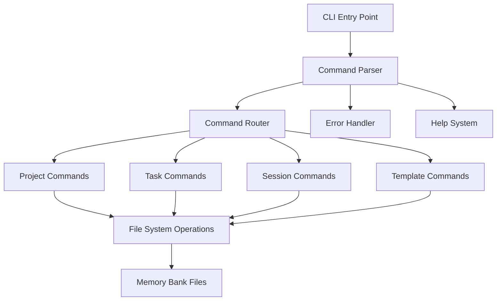

# Memory Bank CLI Architecture
*Created: May 18, 2025*

## Overview
The Memory Bank CLI follows a simple, modular architecture designed for clarity and extensibility while maintaining the KIRSS principle (Keep It Really Simple, Stupid).

## Command Structure Diagram


## Core Components

### 1. CLI Entry Point (`bin/mb`)
- Simple executable that loads the command framework
- Handles basic environment setup
- Initializes configuration
- Routes to command parser

### 2. Command Parser
- Parses command line arguments
- Validates basic command structure
- Handles help flags
- Routes to appropriate command handler
- Manages global flags/options

### 3. Command Router
Handles four primary command groups:
1. **Project Commands** (`mb init`, etc.)
   - Project initialization
   - Configuration management
   - Project status

2. **Task Commands** (`mb task ...`)
   - Task creation
   - Task listing
   - Task status management

3. **Session Commands** (`mb session ...`)
   - Session management
   - Progress tracking
   - Context switching

4. **Template Commands** (`mb template ...`)
   - Template management
   - File generation
   - Template customization

### 4. File System Operations
- Standardized interface for file operations
- Handles:
  - File creation
  - Template processing
  - File updates
  - Path resolution
  - Error handling

## Data Flow Documentation

### Command Execution Flow
1. User enters command
2. Entry point loads configuration
3. Parser validates command
4. Router directs to handler
5. Handler executes operation
6. Results returned to user

### File Operation Flow
1. Command handler requests file operation
2. File system layer validates operation
3. Operation executed with error handling
4. Results returned to handler
5. Handler formats output
6. Output displayed to user

## Directory Structure
```
mb-cli/
├── bin/
│   └── mb              # CLI entry point
├── src/
│   ├── commands/       # Command implementations
│   │   ├── project/
│   │   ├── task/
│   │   ├── session/
│   │   └── template/
│   ├── core/          # Core functionality
│   │   ├── parser.js
│   │   ├── router.js
│   │   └── config.js
│   ├── fs/            # File system operations
│   │   ├── reader.js
│   │   └── writer.js
│   └── utils/         # Shared utilities
│       ├── logger.js
│       └── validator.js
├── templates/         # Default templates
└── config/           # Configuration
```

## Error Handling Strategy
- Every operation returns a Result object
- Errors are logged and formatted for user
- Operations are atomic where possible
- Clear error messages with suggestions
- Debug mode for detailed error info

## Configuration Management
- Uses simple JSON configuration
- Supports:
  - Project-specific settings
  - User preferences
  - Template locations
  - Custom commands

## Extension Points
1. Custom Commands
2. Template Processors
3. Output Formatters
4. Validation Rules

## Success Criteria
1. Commands complete in < 100ms
2. Clear error messages
3. Consistent return codes
4. Predictable file operations
5. Helpful help system

## Security Considerations
1. File operations limited to project
2. No execution of external code
3. Validation of all inputs
4. Safe template processing