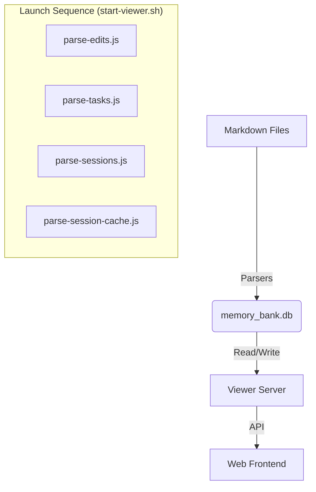

# Modular Memory Bank Viewer Architecture

*Created: 2025-11-22*
*Last Updated: 2025-12-17 10:41:19 IST*
*Related Task: [T21](../tasks/T21.md)*

## Overview

The **Memory Bank Viewer** has evolved from a static HTML file scanner into a robust, database-driven Single Page Application (SPA). This document outlines the architecture of the "Production Workflow," where the viewer serves as the primary interface for interacting with the Memory Bank's SQLite database (`memory_bank.db`), which is synchronized from the markdown files.

## 1. Core Architecture

### The "Sync-on-Launch" Workflow
To bridge the text-based Memory Bank with the database-driven viewer, we employ a synchronization strategy that runs on every launch.

### Components

1.  **Launcher (`start-viewer.sh`)**:
    *   Orchestrates the sync process.
    *   Runs all parsers to rebuild the database from fresh markdown content.
    *   Starts the server pointing to the production database.

2.  **Database Parsers (`memory-bank/database/`)**:
    *   `parse-edits.js`: Parses `edit_history.md` -> `edit_entries`, `file_modifications`.
    *   `parse-tasks.js`: Parses `tasks.md` -> `task_items`, `task_dependencies`.
    *   `parse-sessions.js`: Parses `sessions/*.md` -> `sessions`.
    *   `parse-session-cache.js`: Parses `session_cache.md` -> `session_cache`.

 3.  **Server (`memory-bank/database/server.js`)**:
    *   **Stack**: Node.js + Express + better-sqlite3.
    *   **Role**: Provides a REST API for the database and serves static assets.
    *   **Security**: All filesystem access is restricted to the `memory-bank/` directory.
    *   **Key Endpoints**:
        *   `GET /api/tables`: List all tables with metadata.
        *   `GET /api/table/:name`: Paginated data for a table.
        *   `GET /api/table/:name/schema`: Schema info (FKs, Indexes).
        *   `GET /api/table/:name/record/:id`: Single record with **Related Records** traversal.
        *   `GET /api/search`: Global full-text search.
        *   `GET /api/db/current`: Get current open database path.
        *   `GET /api/db/list`: List .db files under a provided directory (must be under `memory-bank/`).
        *   `POST /api/db/open`: Open a selected database file.
        *   `POST /api/db/create`: Create/open a database file and initialize Phase A schema.
        *   `POST /api/edit-entries`: Create edit_history entry (DB-first write).
        *   `POST /api/edit-entries/:id/modifications`: Add file modification to an edit entry.
        *   `DELETE /api/edit-entries/:id`: Delete edit entry (cascades to file_modifications).
        *   `GET /api/export/edit-history`: Export edit_history markdown from DB.
        *   `GET /api/import/edit-history/preview`: Preview parsed edit_history entries from a markdown source file.
        *   `POST /api/import/edit-history/run`: Import edit_history entries into a selected DB (append/replace).
        *   `GET /api/import/tasks/preview`: Preview parsed tasks from tasks.md (optionally include task file subtasks).
        *   `POST /api/import/tasks/run`: Import tasks into a selected DB (append/replace; optionally include task file subtasks).
        *   `GET /api/import/sessions/preview`: Preview parsed sessions from sessions/*.md.
        *   `POST /api/import/sessions/run`: Import sessions into a selected DB (append/replace).
        *   `GET /api/import/session-cache/preview`: Preview parsed session_cache from session_cache.md.
        *   `POST /api/import/session-cache/run`: Import session_cache into a selected DB (append/replace).
        *   `GET /api/memory-bank/files`: List all memory bank files organized by 5 categories (Core, Tasks, Sessions, Implementation, Database). Returns file metadata (name, path, size, modified timestamp).
        *   `GET /api/memory-bank/file/*`: Fetch specific memory bank file content with security checks. Returns content and metadata as JSON.

4.  **Frontend (`memory-bank/database/public/`)**:
    *   **Stack**: Vanilla JavaScript (ES Modules), CSS Variables (Theming).
    *   **Modes**:
        *   **Viewer**: Browse database tables and memory-bank files.
        *   **Editor**: Create/select databases and run edit_history import workflows.
    *   **Structure**:
        *   `app.js`: Main controller, state management, sorting logic.
        *   `router.js`: Hash-based routing with History API support.
        *   `api.js`: Data fetching layer.
        *   `ui.js`: Pure HTML rendering functions (Components).

## 2. Database Schema

The viewer relies on a "Universal Schema" that standardizes the diverse markdown formats into relational tables.

### Core Tables
| Table | Source | Description |
| :--- | :--- | :--- |
| `task_items` | `tasks.md` | Registry of all tasks (Active, Completed, Paused). |
| `task_dependencies` | `tasks.md` | Graph of task relationships. |
| `sessions` | `sessions/*.md` | Historical timeline of work sessions. |
| `session_cache` | `session_cache.md` | Snapshot of the current active session. |
| `edit_entries` | `edit_history.md` | Chronological log of work units. |
| `file_modifications` | `edit_history.md` | Granular file changes linked to edit entries. |

### Key Relationships
*   `file_modifications` → `edit_entries` (via `edit_entry_id`)
*   `task_dependencies` → `task_items` (via `task_id`, `depends_on`)
*   *Future*: `edit_entries` → `sessions` (via date/time correlation)

## 3. Frontend Features

### Modular Design
The frontend is split into distinct modules to separate concerns:
*   **UI Module**: Handles all DOM manipulation and HTML generation. Uses template literals for zero-build-step components.
*   **App Module**: Manages application state (current view, filter, sort) and coordinates between API and UI.
*   **Router Module**: Manages URL state, enabling deep linking and browser back/forward navigation.

### Smart Interactions
*   **Sorting**: Custom logic in `app.js` handles:
    *   **Task IDs**: Sorts `T1, T2, T10` correctly (numeric) instead of `T1, T10, T2` (lexical).
    *   **Dates**: Recognizes ISO date strings and sorts chronologically.
*   **Dual View Modes**: Toggle between **Table View** (dense data) and **Card View** (rich summaries).
*   **Related Records**: When viewing a detailed record, the UI automatically fetches and displays related data via Foreign Keys (e.g., viewing a Task shows its Dependencies).
*   **Tab Navigation**: Switch between **Database Mode** (SQLite records) and **Files Mode** (markdown file browsing).
*   **File Browser**: Category-based organization with markdown rendering (marked.js) and syntax highlighting for code files.
*   **History Integration**: Browser back/forward navigation works seamlessly across both database and file modes via History API state management.

## 4. Future Roadmap

### Phase 3: Write Capabilities
*   **Goal**: Allow users to Create and Edit records directly in the Viewer.
*   **Implementation**:
    *   Add `POST/PUT` endpoints to `server.js`.
    *   Implement "Reverse Parsers" (or Template Generators) to write changes back to Markdown files.
    *   Create Form UI in `ui.js`.

### Phase 4: Universal Search
*   Extend the search functionality to include file contents (using `grep` or a search index) beyond just database fields.
