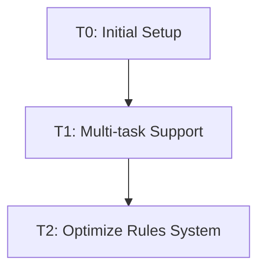

# Task Registry
*Last Updated: April 15, 2025*

## Active Tasks
| ID | Title | Status | Priority | Started | Dependencies | Owner |
|----|-------|--------|----------|---------|--------------|-------|
| T1 | Update Memory Bank with multi-task support | 🔄 IN PROGRESS | HIGH | 2025-04-14 | - | Deepak |
| T2 | Optimize Rules System for Token Efficiency | ⬜ NOT STARTED | HIGH | - | T1 | Deepak |

## Task Details

### T2: Optimize Rules System for Token Efficiency
**Description**: Restructure the integrated rules system to minimize token usage while maintaining functionality
**Status**: ⬜ NOT STARTED
**Priority**: HIGH
**Dependencies**: T1
**Completion Criteria**:
- Create a tiered rule system with Core Rules and specialized modules
- Establish a dynamic loading mechanism for rule modules
- Restructure folder organization to support modular rules
- Implement a condensed core-rules.md file (~20% of current size)
- Move detailed examples and workflows to separate files
- Create a system for progressive disclosure of instructions

**Related Files**:
- New `core/core-rules.md`
- New `modules/` directory with specialized rule modules
- New folder structure with `context-store/` replacing `memory-bank/`
- New `loader.md` for dynamic module loading

**Notes**:
This task aims to significantly reduce token usage by implementing a modular, on-demand loading system for rules and instructions.

### T1: Update Memory Bank with multi-task support
**Description**: Update the Memory Bank system to support tracking and managing multiple concurrent tasks
**Status**: 🔄 IN PROGRESS
**Last Active**: 2025-04-14 15:30 UTC
**Completion Criteria**:
- Create tasks.md file for task registry
- Update session_cache.md to support multiple task contexts
- Update integrated rules with multi-task support
- Create templates for all memory bank files in templates folder
- Update documentation and workflows to support task switching

**Related Files**:
- `integrated-rules-v4.md`
- `memory-bank/tasks.md`
- `memory-bank/session_cache.md`
- `memory-bank/templates/`

**Notes**:
Updated system maintains clear boundaries between tasks while preserving context when switching between them.

## Completed Tasks
| ID | Title | Completed | Related Tasks |
|----|-------|-----------|---------------|
| T0 | Initial Memory Bank setup | 2025-04-10 | - |

## Task Relationships

