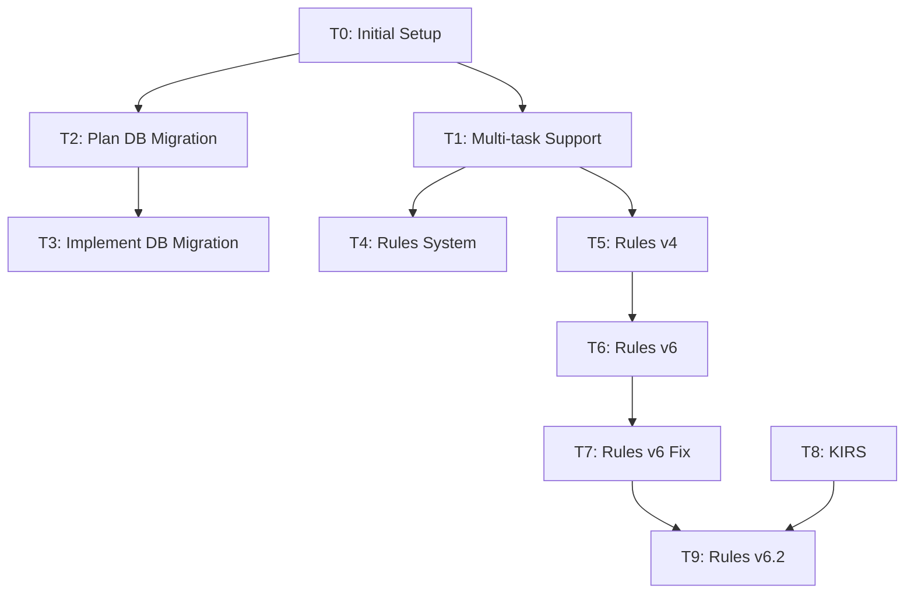

# Task Registry
*Last Updated: April 25, 2025*

## Active Tasks
| ID | Title | Status | Priority | Started | Dependencies | Details |
|----|-------|--------|----------|---------|--------------|---------|
| T9 | Implement Rules v6.2 Changes | 🔄 | HIGH | 2025-04-30 | T7, T8 | [Details](tasks/T9.md) |
| T8 | Add KIRS Principle | 🔄 | HIGH | 2025-04-25 | - | [Details](tasks/T8.md) |
| T1 | Multi-task Support | 🔄 | HIGH | 2025-04-14 | - | [Details](tasks/T1.md) |
| T3 | Implement DB Migration | 🔄 | HIGH | 2025-04-15 | T2 | [Details](tasks/T3.md) |
| T4 | Optimize Rules System | 🔄 | HIGH | 2025-04-15 | T1 | [Details](tasks/T4.md) |
| T5 | Optimize Rules v4 | 🔄 | MEDIUM | 2025-04-17 | - | [Details](tasks/T5.md) |

## Task Structure
All task details are now maintained in individual files under the `tasks/` directory.
See individual task files for:
- Detailed descriptions
- Completion criteria
- Related files
- Progress tracking
- Context and notes

## Completed Tasks
| ID | Title | Completed | Related Tasks | Archive |
|----|-------|-----------|---------------|---------|
| T0 | Initial Memory Bank setup | 2025-04-10 | - | [Details](archive/T0.md) |
| T2 | Plan Database Migration | 2025-04-15 | T3 | [Details](archive/T2.md) |
| T6 | Streamline Rules v6 | 2025-04-20 | T5 | [Details](archive/T6.md) |
| T7 | Fix Rules v6 Ambiguities | 2025-04-20 | T6 | [Details](archive/T7.md) |

## Task Relationships
