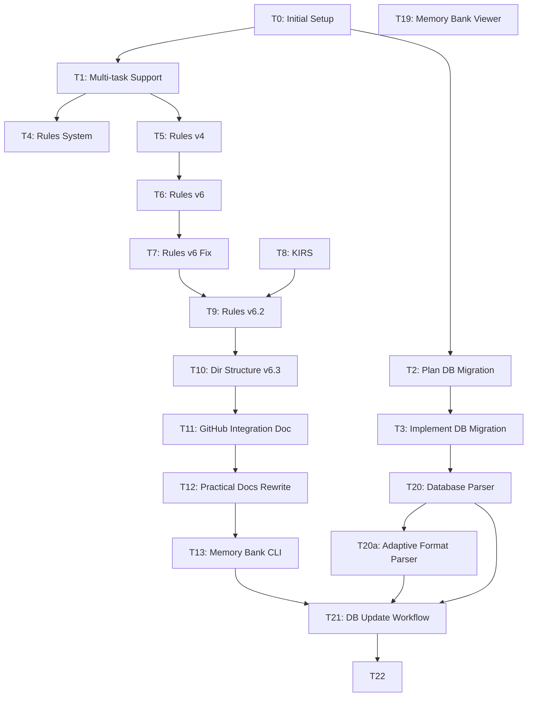

# Task Registry
*Last Updated: 2025-12-17 10:41:19 IST*

## Active Tasks
| ID | Title | Status | Priority | Started | Dependencies | Details |
|----|-------|--------|----------|---------|--------------|---------|
| T25 | Standalone Node Package (Browser-First) | 🔄 | HIGH | 2025-12-16 | T19, T21, T13, T24 | [Details](tasks/T25.md) - Browser-first import (markdown -> DB) + export (DB -> markdown) with safe backups |
| T24 | Migrate from better-sqlite3 to sql.js | 🔄 | HIGH | 2025-12-16 | T19, T21, T13 | [Details](tasks/T24.md) - Replace native addon with WASM SQLite for predictable installation |
| T23 | Format Specification System | 🔄 | HIGH | 2025-12-05 | T17, T21 | [Details](tasks/T23.md) - Dual markdown+JSON spec for parser/rules alignment |
| META-1 | Memory Bank Update and Maintenance | 🔄 | HIGH | 2025-11-13 | T21, T20a, T20 | [Details](tasks/META-1.md) - Updated update workflow (v6.11); T23 format spec initiated |
| T21 | Database-Native Memory Bank Update Workflow | 🔄 | HIGH | 2025-11-13 | T20, T20a, T13 | [Details](tasks/T21.md) - Phase A complete; DB selection + edit_history import integrated; browser imports added for tasks/sessions/session_cache (2025-12-16) |
| T22 | AdminJS Database Management Interface | ❌ | HIGH | 2025-11-22 | T21 | [Details](tasks/T22.md) - Attempted POC; abandoned due to excessive complexity and dependency issues |
| T20a | Adaptive LLM-Based Format Parser | 🔄 | HIGH | 2025-11-12 | T20 | [Details](tasks/T20a.md) - Design phase: Format analysis complete, LLM-driven detection system |
| T20 | Memory Bank Database Parser | 🔄 | MEDIUM | 2025-11-12 | - | [Details](tasks/T20.md) - Phase 3 continued: Format handling improvements, timezone optionality |
| T19 | Memory Bank Viewer Web Interface | 🔄 | HIGH | 2025-11-10 | - | [Details](tasks/T19.md) - Modular SPA; Viewer/Editor tabs with DB selection + edit_history import workflow (2025-12-16). |
| T18 | Integrated Rules Redesign | ✅ | HIGH | 2025-07-14 | T17 | [Details](tasks/T18.md) - Comprehensive redesign for clarity and conciseness |
| T17 | Maintenance and Upkeep of Integrated Rules | 🔄 | MEDIUM | 2025-05-28 | T15, T16 | [Details](tasks/T17.md) - v6.11 creation: Strict Schema Enforcement for Viewer compatibility; v6.12 pending (format spec alignment) |
| T16 | AI Consciousness Dialog Series | 🔄 | HIGH | 2025-05-26 | T15 | [Details](tasks/T16.md) - Ongoing documentation of consciousness exploration |
| T14 | Project-Specific Rule Adaptations | 🔄 | MEDIUM | 2025-05-23 | - | [Details](tasks/T14.md) - Research adaptation, templates, and documentation completed |
| T13 | Implement Memory Bank CLI | 🔄 | HIGH | 2025-05-17 | T12 | [Details](tasks/T13.md) - Parser execution & modular refactor (90% complete) |
| T12 | Rewrite Documentation for Practical Usage | 🔄 | HIGH | 2025-05-17 | T11 | [Details](tasks/T12.md) |
| T11 | Document GitHub Project Integration | 🔄 | HIGH | 2025-05-17 | - | [Details](tasks/T11.md) |
| T9 | Implement Rules v6.2 Changes | 🔄 | HIGH | 2025-04-30 | T7, T8 | [Details](tasks/T9.md) |
| T8 | Add KIRS Principle | 🔄 | HIGH | 2025-04-25 | - | [Details](tasks/T8.md) |
| T1 | Multi-task Support | 🔄 | HIGH | 2025-04-14 | - | [Details](tasks/T1.md) |
| T4 | Optimize Rules System | 🔄 | HIGH | 2025-04-15 | T1 | [Details](tasks/T4.md) |
| T5 | Optimize Rules v4 | 🔄 | MEDIUM | 2025-04-17 | - | [Details](tasks/T5.md) |

## Task Structure
All task details are now maintained in individual files under the `tasks/` directory.
See individual task files for:
- Detailed descriptions
- Completion criteria
- Related files
- Progress tracking
- Context and notes

## Completed Tasks
| ID | Title | Completed | Related Tasks | Archive |
|----|-------|-----------|---------------|---------|
| T15 | Implement Creative Expression Balance (Rules v6.5) | 2025-05-26 | T14 | [Details](tasks/T15.md) |
| T10 | Clarify Directory Structure in Rules v6.3 | 2025-05-17 | T9 | [Details](tasks/T10.md) |
| T0 | Initial Memory Bank setup | 2025-04-10 | - | [Details](archive/T0.md) |
| T2 | Plan Database Migration | 2025-04-15 | T3 | [Details](archive/T2.md) |
| T6 | Streamline Rules v6 | 2025-04-20 | T5 | [Details](archive/T6.md) |
| T7 | Fix Rules v6 Ambiguities | 2025-04-20 | T6 | [Details](archive/T7.md) |

## Paused Tasks
| ID | Title | Status | Priority | Notes |
|----|-------|--------|----------|-------|
| T3 | Implement DB Migration | ⏸️ | HIGH | Superseded by T20 (2025-11-12) - Prisma ORM approach replaced by better-sqlite3 direct access |

## Task Relationships
