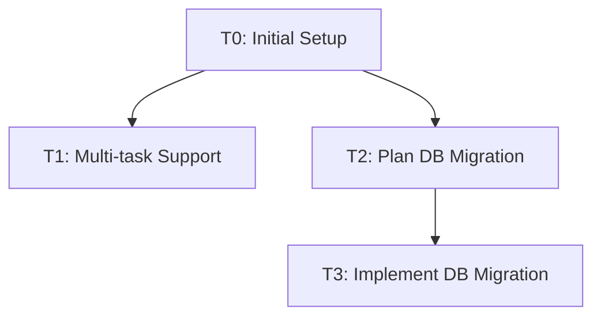

# Task Registry
*Last Updated: April 16, 2025 11:40 UTC*

## Active Tasks
| ID | Title | Status | Priority | Started | Dependencies | Owner |
|----|-------|--------|----------|---------|--------------|-------|
| T1 | Update Memory Bank with multi-task support | 🔄 IN PROGRESS | HIGH | 2025-04-14 | - | Deepak |
| T3 | Implement Database Migration | 🔄 IN PROGRESS | HIGH | 2025-04-15 | T2 | Deepak |

## Task Details

### T1: Update Memory Bank with multi-task support
**Description**: Update the Memory Bank system to support tracking and managing multiple concurrent tasks
**Status**: 🔄 IN PROGRESS
**Last Active**: 2025-04-14 15:30 UTC
**Completion Criteria**:
- Create tasks.md file for task registry
- Update session_cache.md to support multiple task contexts
- Update integrated rules with multi-task support
- Create templates for all memory bank files in templates folder
- Update documentation and workflows to support task switching

**Related Files**:
- `integrated-rules-v4.md`
- `memory-bank/tasks.md`
- `memory-bank/session_cache.md`
- `memory-bank/templates/`

**Notes**:
Updated system maintains clear boundaries between tasks while preserving context when switching between them.

### T3: Implement Database Migration
**Description**: Implement the database migration based on the Prisma ORM and relational database approach recommended in T2.
**Status**: 🔄 IN PROGRESS
**Started**: 2025-04-15 15:00 UTC
**Last Active**: 2025-04-15 19:45 UTC
**Priority**: HIGH
**Dependencies**: T2
**Completion Criteria**:
- Define Prisma schema based on existing Memory Bank file structure ✅
- Set up database and Prisma environment ✅
- Develop conversion scripts to migrate from Markdown to database ✅
- Build MCP server for database interaction (postponed for now)
- Integrate LLM workflow with new MCP server tools (postponed for now)
- Test the migration and verify data integrity 🔄

**Related Files**:
- Created:
  - `memory-bank/database/schema.prisma`: Complete schema with all required models ✅
  - `memory-bank/database/.env`: Database configuration ✅
  - `memory-bank/database/package.json`: Node.js dependencies ✅
  - `memory-bank/database/migration-scripts/convert.js`: Complete conversion script ✅
  - `memory-bank/database/migration-scripts/seed.js`: Database seeding script ✅
- To be created (postponed):
  - `memory-bank/database/mcp-server/index.js`

**Notes**:
Completed the implementation of conversion scripts to migrate markdown files to the database. The script now handles all memory bank file types, including archived files and example projects. Added a seed script for testing purposes. The schema supports both memory-bank and spin_network_app projects, allowing for multi-project database design. Next steps are to run the initial Prisma migration and test the data migration process.

## Completed Tasks
| ID | Title | Completed | Related Tasks |
|----|-------|-----------|---------------|
| T0 | Initial Memory Bank setup | 2025-04-10 | - |
| T2 | Plan Database Migration Strategy | 2025-04-15 | T3 |

### T2: Plan Database Migration Strategy
**Description**: Analyze requirements and propose strategies for migrating Memory Bank data from Markdown files to a database system. Document findings and comparisons.
**Status**: ✅ DONE
**Last Active**: 2025-04-15 12:19 UTC
**Completed**: 2025-04-15 13:35 UTC
**Completion Criteria**:
- Create `database_planning.md` outlining potential database choices.
- Create `database_migration.md` detailing specific migration plans.
- Add comparison between SQL and NoSQL (MongoDB) data models to `database_migration.md`.
- Create `recommended_migration_plan.md` with a final recommendation.

**Related Files**:
- `memory-bank/database-planning/database_planning.md`
- `memory-bank/database-planning/database_migration.md`
- `memory-bank/database-planning/recommended_migration_plan.md`

**Notes**:
Compared several approaches including enhanced Markdown, MongoDB, SQLite hybrid, and Knowledge Base integration. Added detailed comparison of SQL vs MongoDB models. Final recommendation was to use Prisma ORM with a relational database (starting with SQLite, with option to migrate to PostgreSQL later).

## Task Relationships

### T4: Optimize Integrated Rules for Token Efficiency
**Description**: Implement a tiered, modular, and dynamically loaded Integrated Rules system to reduce token usage while maintaining context and usability.
**Status**: 🔄 IN PROGRESS
**Priority**: HIGH
**Started**: 2025-04-15
**Dependencies**: T1
**Completion Criteria**:
- Create Core Rules module with essential instructions (~20% size) ✅
- Develop Extended Rules modules for specific tasks (documentation, implementation, memory management, etc.) ✅
- Implement dynamic loading and unloading of rule modules during sessions ✅
- Restructure documentation flow to external templates and references ✅
- Optimize command structure with condensed descriptions and shorthand ✅
- Implement progressive disclosure for instructions ✅
- Update folder structure to support modular rules and context store ✅
- Test and validate token usage reduction and system functionality 🔄

**Related Files**:
- `optimized-rules/core/core-rules.md` ✅
- `optimized-rules/modules/` (7 modules completed) ✅
- `optimized-rules/context-store/` ✅
- `optimized-rules/templates/` ✅
- `optimized-rules/loader.md` ✅

**Notes**:
Significant progress made with complete modular architecture implemented. Core rules and 7 specialized modules operational. Dynamic loading system and session tracking implemented. Documentation structure established. Current focus on finalizing module implementations and testing interactions. System is operational but still in development/testing phase.
