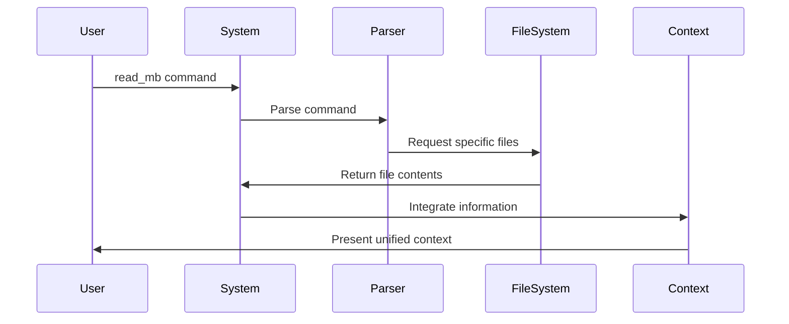
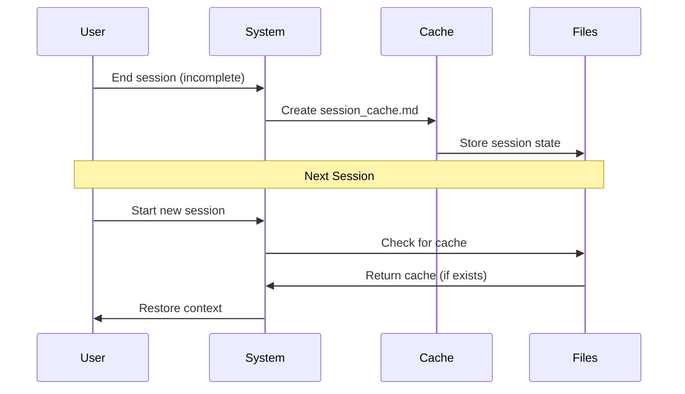
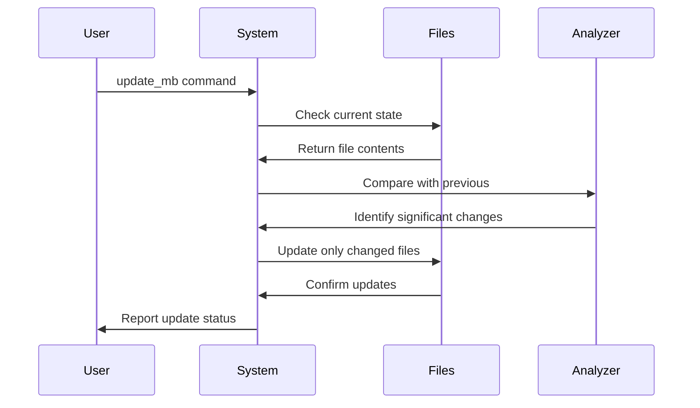
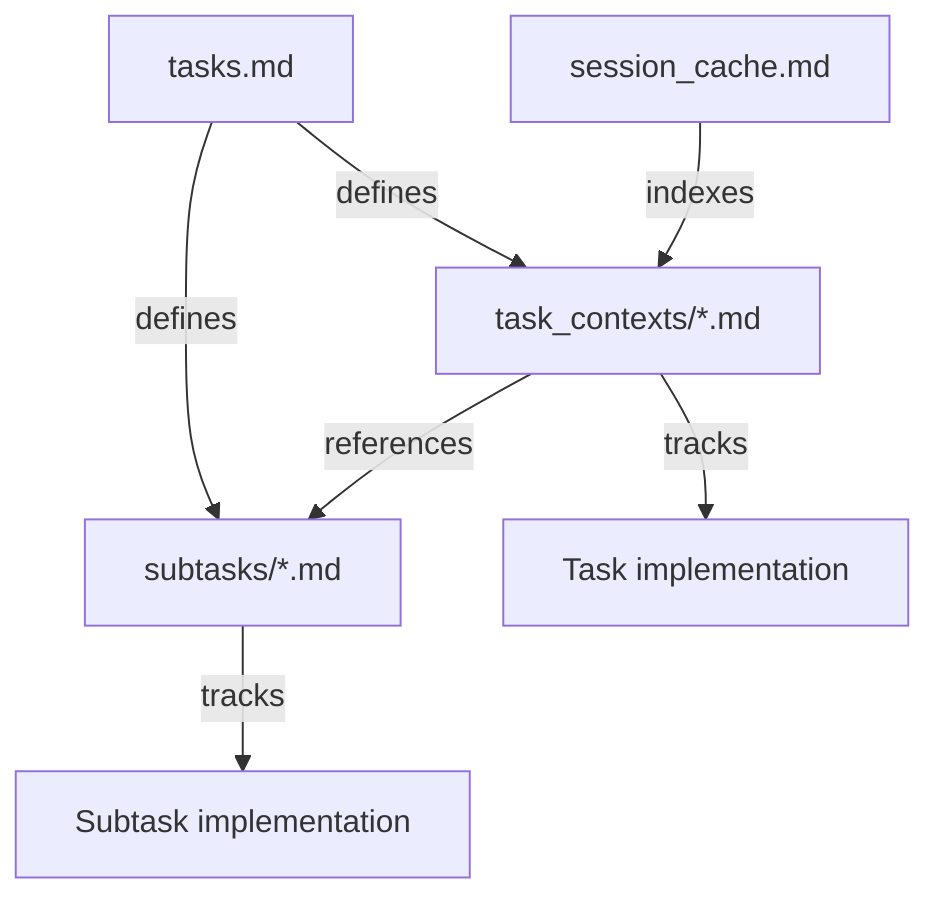

# Technical Context: Memory Bank Implementation

## Technology Stack
The Memory Bank system is implemented as a documentation structure using:

- **Markdown**: All documentation files use Markdown format
- **Directory Structure**: Organized within the `/Users/deepak/code/memory-bank/memory-bank/` directory
- **File System Operations**: Reading and writing files as needed

## Implementation Details

### File Format Standards
All Memory Bank files follow these standards:

1. Use consistent Markdown formatting
2. Include clear section headers with hierarchical structure
3. Provide timestamps for all updates
4. Use relative links for cross-references
5. Include metadata at the top of each file

### Progressive Loading Implementation
The progressive loading system is implemented through:

1. **Tiered File Organization**: Files are organized into Critical, Essential, and Reference tiers
2. **Command Parser**: Interprets `read_mb` commands to determine which files to load
3. **Context Integration**: Combines information from multiple files into a coherent context



### Session Continuity Implementation
The session continuity system is implemented through:

1. **Status Tracking**: Monitoring session state (COMPLETE or CONTINUING)
2. **Cache Creation**: Generating session_cache.md for in-progress work
3. **Cache Detection**: Checking for existing cache at session start
4. **Context Restoration**: Loading cache information to restore context



### Differential Update Implementation
The differential update system is implemented through:

1. **Change Detection**: Comparing current file state with previous version
2. **Significance Assessment**: Determining if changes warrant an update
3. **Targeted Updates**: Modifying only specific files as needed
4. **Timestamp Management**: Updating timestamps for modified files



## Technical Constraints

### Storage Constraints
- All files must be stored within the designated project directory
- File names must follow the established naming conventions
- File sizes should be optimized for efficient loading

### Processing Constraints
- File loading should minimize token usage
- Commands should be parsed efficiently
- Cache creation should capture only essential context

### Security Constraints
- All file operations must be within the designated project directory
- Shell commands should be avoided for file operations
- User approval should be required for sensitive operations

## Technical Dependencies

### File System Access
The system depends on file system access for:
- Reading documentation files
- Writing updates to files
- Creating and reading cache files

### Markdown Processing
The system depends on Markdown processing for:
- Parsing documentation content
- Formatting information hierarchically
- Creating structured documentation

### Command Parsing
The system depends on command parsing for:
- Interpreting user commands
- Determining appropriate actions
- Managing session state

## API Reference

### Reading Commands
```
read_mb                    // Read Critical tier only
read_mb standard           // Read Critical + Essential tiers
read_mb complete           // Read all Memory Bank files
read_mb [file1] [file2]    // Read specific files only
```

### Update Commands
```
update_mb                  // Update changed files only
update_mb complete         // Update all Memory Bank files
update_mb [file1] [file2]  // Update specific files only
```

### Session Commands
```
continue_session           // Continue from session cache
complete_session           // Mark session as complete
cache_session              // Create continuation point
```

### Modular Task Context Implementation
The modular task context system is implemented through:

1. **Directory Structure**: Dedicated directories for task_contexts/ and subtasks/
2. **Context Files**: Individual files for each task and complex subtask
3. **Index System**: session_cache.md transformed into a lightweight index
4. **Link Management**: Cross-references between related context files
5. **Task Hierarchy**: Support for parent-child relationships



Last Updated: April 17, 2025